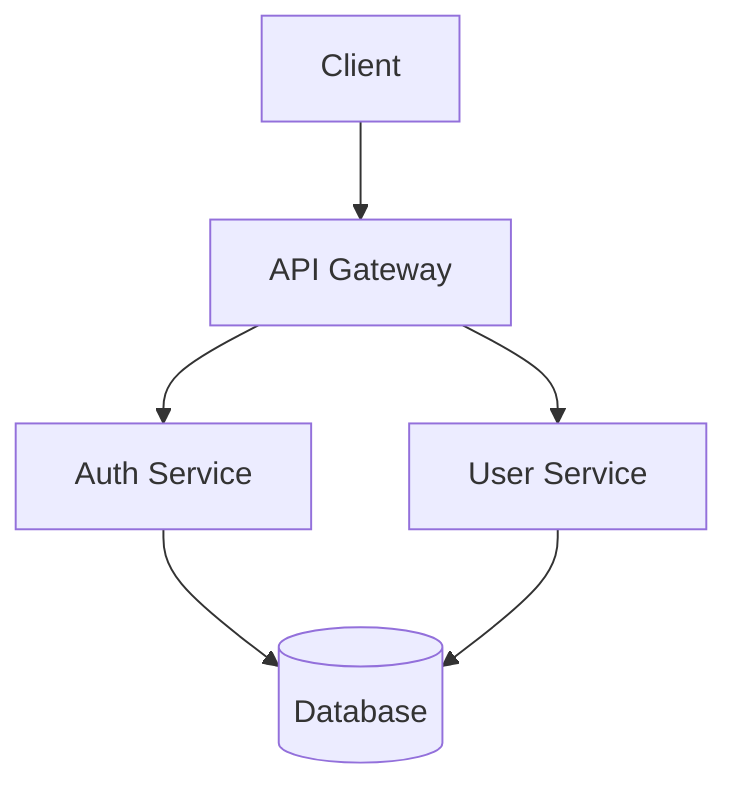
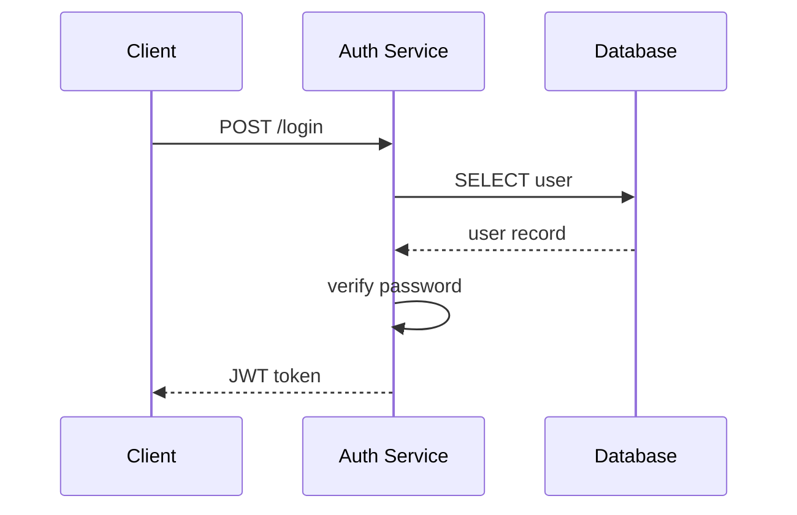

# AI時代のドキュメント設計

AIがドキュメントを読み取り、理解し、活用できる形式で設計書を作成するためのガイドです。

---

## 原則

### 1. テキストベース

| 推奨 | 非推奨 |
|------|--------|
| Markdown | Excel |
| YAML/JSON | Word |
| PlantUML/Mermaid | PowerPoint |

**理由**: 差分管理、検索、AI解析がすべて容易になります。

### 2. 構造化

```markdown
# 大見出し（機能名/設計書名）
## 中見出し（セクション）
### 小見出し（詳細項目）

- リスト形式で箇条書き
- 表形式で対比・一覧

| 項目 | 内容 |
|------|------|
```

### 3. メタデータの明示

ファイル先頭にYAMLフロントマターで文脈を明示:

```yaml
---
type: requirements | design | investigation | interview
stage: phase-1/stage-2/substage-3
status: draft | review | approved
created: 2025-01-15
updated: 2025-01-20
author: team-member
---
```

---

## `.kiro/specs/` との連携

Kiroは `.kiro/specs/` 配下の仕様書を参照して開発を進めます。SubStageの成果物をここに格納することで、AIが文脈を理解しやすくなります。

### ディレクトリ構造

```
.kiro/
└── specs/
    └── {feature-or-domain}/
        ├── requirements.md      # 要件定義
        ├── design.md            # 設計書
        ├── investigation/       # 調査結果（SubStage成果物）
        │   ├── as-is-source.md
        │   ├── as-is-behavior.md
        │   └── tech-research.md
        ├── interviews/          # インタビュー結果
        │   ├── 2025-01-15-customer-a.md
        │   └── 2025-01-20-stakeholder-b.md
        └── decisions/           # 設計判断
            └── adr-001-framework-selection.md
```

### SubStage成果物の格納ルール

| SubStageの成果物 | 格納先 | 備考 |
|------------------|--------|------|
| 現行仕様調査 | `investigation/as-is-*.md` | source/behavior を分離 |
| 技術調査 | `investigation/tech-research.md` | 候補技術の比較等 |
| ヒアリング結果 | `interviews/YYYY-MM-DD-{name}.md` | 日付prefix必須 |
| 要件定義 | `requirements.md` | 確定要件 |
| 設計書 | `design.md` | 基本設計・詳細設計 |
| 設計判断 | `decisions/adr-*.md` | ADR形式推奨 |

---

## 設計書フォーマット

### 要件定義 (`requirements.md`)

```markdown
---
type: requirements
stage: phase-1/stage-1/substage-2
status: approved
---

# {機能名} 要件定義

## 概要
<!-- 1-2文で機能の目的 -->

## ユーザーストーリー
- [ ] ユーザーとして、〇〇したい。なぜなら△△だから。

## 機能要件

| ID | 要件 | 優先度 | 備考 |
|----|------|--------|------|
| REQ-001 | ユーザーがログインできる | Must | |
| REQ-002 | パスワードリセットができる | Should | |

## 非機能要件

| カテゴリ | 要件 |
|----------|------|
| 性能 | レスポンス3秒以内 |
| セキュリティ | パスワードはハッシュ化 |

## 制約事項
- 既存DBスキーマとの互換性維持

## 用語定義

| 用語 | 定義 |
|------|------|
| ユーザー | システムにログインできる人 |
```

### 基本設計 (`design.md`)

```markdown
---
type: design
stage: phase-2/stage-1/substage-1
status: draft
---

# {機能名} 設計書

## システム構成

<!-- Mermaid記法で図示 -->


## API仕様

### POST /api/auth/login

| 項目 | 内容 |
|------|------|
| Method | POST |
| Path | /api/auth/login |
| Auth | 不要 |

**Request Body**
```json
{
  "email": "string",
  "password": "string"
}
```

**Response 200**
```json
{
  "token": "string",
  "expiresAt": "ISO8601"
}
```

## データベース設計

### users テーブル

| カラム | 型 | 制約 | 説明 |
|--------|-----|------|------|
| id | UUID | PK | |
| email | VARCHAR(255) | UNIQUE, NOT NULL | |
| password_hash | VARCHAR(255) | NOT NULL | bcrypt |
| created_at | TIMESTAMP | NOT NULL | |

## シーケンス図


```

### 調査結果 (`investigation/*.md`)

```markdown
---
type: investigation
stage: phase-1/stage-1/substage-1
status: completed
---

# {調査対象} 調査結果

## 調査目的
<!-- なぜこの調査が必要か -->

## 調査方法
- ソースコード解析
- 動作テスト
- ドキュメントレビュー

## 発見事項

### 現行仕様

| 項目 | 内容 | 確認方法 |
|------|------|----------|
| 認証方式 | Session Cookie | ソース確認 |
| セッション期限 | 30分 | 動作テスト |

### 課題・リスク

| ID | 課題 | 影響度 | 対策案 |
|----|------|--------|--------|
| ISS-001 | セッション管理が独自実装 | 高 | Spring Security移行 |

## 次のアクション
- [ ] Spring Securityの詳細調査
- [ ] 移行工数見積もり

## 参照先
- [as-is-source.md](./as-is-source.md)
- [as-is-behavior.md](./as-is-behavior.md)
```

### インタビュー結果 (`interviews/*.md`)

```markdown
---
type: interview
stage: phase-1/stage-2/substage-1
status: completed
date: 2025-01-15
participants:
  - 顧客担当者A
  - PM
  - 開発リーダー
---

# インタビュー: {テーマ}

## 目的
<!-- このインタビューで明らかにしたいこと -->

## 議事

### Q1: {質問}
**回答**:
<!-- 回答内容 -->

**補足**:
<!-- 追加コメント、確認事項 -->

### Q2: {質問}
**回答**:

## 決定事項

| ID | 決定内容 | 決定者 |
|----|----------|--------|
| DEC-001 | ログイン画面のUIは現行踏襲 | 顧客担当者A |

## 宿題事項

| ID | 内容 | 担当 | 期限 |
|----|------|------|------|
| TODO-001 | 現行画面のスクリーンショット提供 | 顧客 | 2025-01-20 |

## 次回予定
- 日時: 2025-01-22 14:00
- テーマ: データ移行要件
```

### 設計判断 (ADR形式: `decisions/*.md`)

```markdown
---
type: decision
stage: phase-2/stage-1/substage-2
status: accepted
date: 2025-01-18
---

# ADR-001: 認証フレームワークの選定

## ステータス
Accepted

## コンテキスト
現行システムはSeasar2の独自認証を使用している。SpringBoot移行に伴い、認証基盤を刷新する必要がある。

## 検討した選択肢

### 1. Spring Security
- ✅ デファクトスタンダード
- ✅ ドキュメント豊富
- ⚠️ 学習コスト

### 2. 独自実装
- ✅ 柔軟性
- ❌ 保守コスト
- ❌ セキュリティリスク

### 3. Auth0/Okta (外部サービス)
- ✅ 実装コスト低
- ❌ 外部依存
- ❌ コスト

## 決定
**Spring Security** を採用する。

## 理由
- 業界標準であり、長期保守が期待できる
- チームの学習投資が他プロジェクトでも活きる
- セキュリティアップデートが継続的に提供される

## 影響
- 開発者向けSpring Security研修を実施（1日）
- 認証関連の設計パターンをdocs/patterns/に追加
```

---

## Kiroへの指示での活用

`.kiro/specs/` に構造化されたドキュメントがあると、以下のような指示が効果的になります:

```
# 良い例
「.kiro/specs/auth/requirements.md の REQ-001 を実装してください」
「.kiro/specs/auth/investigation/as-is-behavior.md を参考に、同等の動作を実現してください」

# 悪い例
「ログイン機能を作ってください」（文脈なし）
```

---

## チェックリスト

ドキュメント作成時に確認:

- [ ] YAMLフロントマターでメタデータを明示したか
- [ ] 見出し構造が論理的か（H1→H2→H3）
- [ ] 表形式で整理できる箇所は表にしたか
- [ ] 図はMermaid/PlantUMLで記述したか
- [ ] 関連ドキュメントへのリンクを貼ったか
- [ ] SubStageとの対応が明確か
